# OpenVPN

## Instalación

### En el servidor 

Para configurar el servidor de VPN utilizaremos **_OpenVPN_**, mientras que para crear la **Autoridad certificadora** (CA) elegimos **_EasyRSA_**.

Ambos se pueden descargar directamente de los repositorios oficiales:

```sh
ferrusca@ferrusca:~$ sudo apt install openvpn easy-rsa
```

#### Creación de la Autoridad Certificadora

Con _EasyRSA_ es más facil la creación de la autoridad que expedirá los certificados tanto para el servidor como para los clientes. De igual manera, ésta se encargará de firmar las peticiones de certificado (CSR - _Certificate Signing Request_) de cualquier cliente que se desee integrar a la VPN.

Para ello, ejecutamos: 

```sh
ferrusca@ferrusca:~$ make-cadir ~/caroot
```

Lo cual nos creará un directorio con todo lo necesario para el funcionamiento de la CA, por ejemplo un directorio para llaves, los archivos de configuración de _OpenSSL_, directorios para _requests_ y _revocaciones_ y el archivo **_vars_** que contendrá la información necesaria para la expedicion de peticiones de certificado.

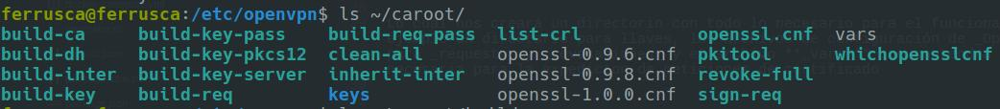

Editamos el archivo _vars_ para proveer los valores del _CSR_ por defecto

```sh
ferrusca@ferrusca:~$ vim caroot/vars
```

Editamos las siguientes líneas del archivo:

```sh
export KEY_COUNTRY="MX"
export KEY_PROVINCE="Cd. de Mx."
export KEY_CITY="Coyoacan"
export KEY_ORG="Admin. de Redes"
export KEY_EMAIL="foo@bar.mail"
export KEY_OU="Equipo6"
# X509 Subject Field
export KEY_NAME="equipo6"
```

Guardamos el archivo, lo leemos y limpiamos el workspace:
```sh
ferrusca@ferrusca:~$ source caroot/vars
ferrusca@ferrusca:~$ ./caroot/clean-all
```

Ahora, creamos la Autoridad Certificadora ejecutando el script de _EasyRSA_ 

```sh
ferrusca@ferrusca:~$ ./caroot/build-ca
```

En caso de que no se encuentre el archivo `openssl.cnf`, conviene hacer una liga del archivo que de configuración que viene dentro del directorio

```sh
ferrusca@ferrusca:~$ cd caroot/
ferrusca@ferrusca:~/caroot$ ln -s openssl-1.0.0.cnf openssl.cnf
ferrusca@ferrusca:~$ ./build-ca
```

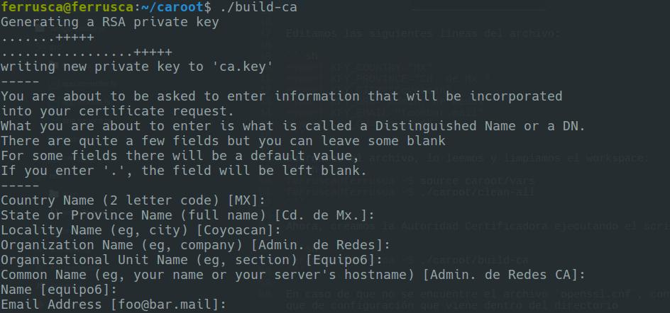

Creando la llave para el servidor
=================================

Una vez creada nuestra la CA, expediremos una llave y certificado para el servidor OpenVPN, hay que especificar el **Common Name** o nombre del equipo que lo utilizará, este nombre debe ser único

```sh
ferrusca@ferrusca:~/caroot$ ./build-key-server server
```

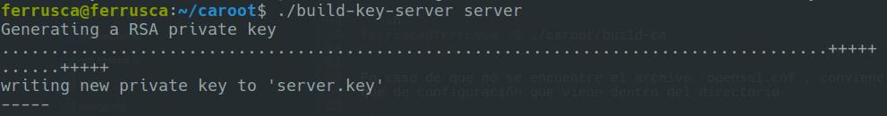
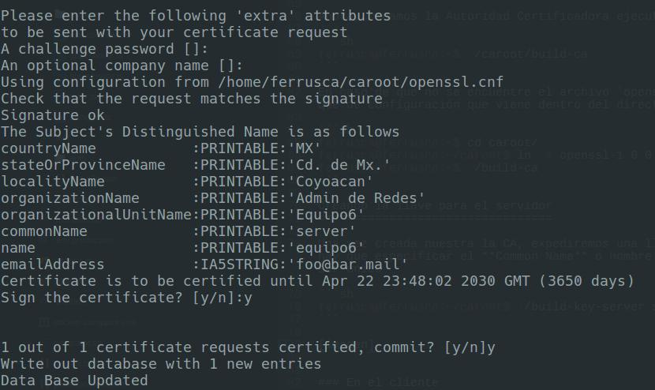


Luego, creamos la llave Diffie-Helmann para la autenticacióny de igual manera generamos la firma HMAC que servirá para verificar la integridad TLS del servidor. Esto lo hacemos ejecutando los scripts

```sh
ferrusca@ferrusca:~/caroot$ ./build-dh
ferrusca@ferrusca:~/caroot$ openvpn --genkey --secret keys/ta.key
```


Generación de la llave del cliente
==================================

Para ello especificamos el CN del cliente, en este caso será `cliente1`

```sh
ferrusca@ferrusca:~/caroot$ ./build-key client1
```

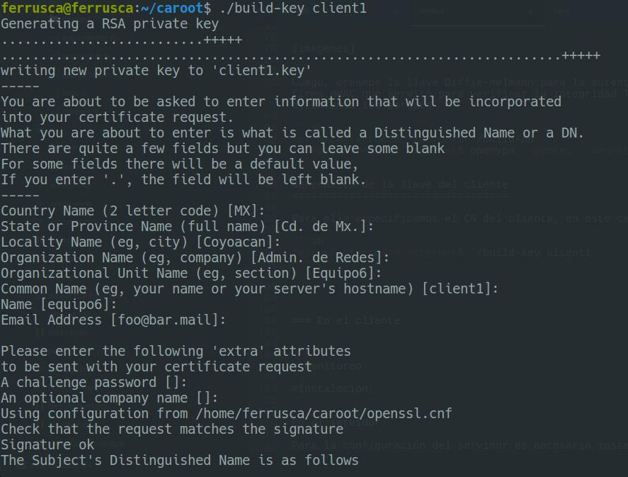
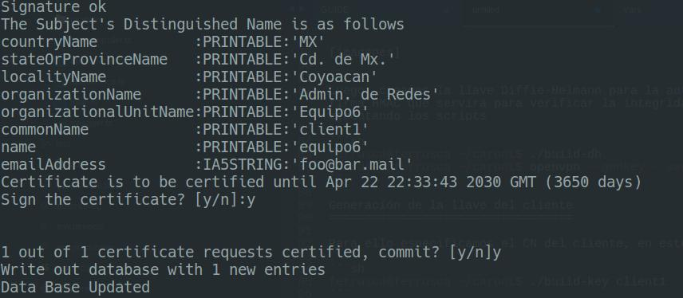


**NOTA:** Este último paso lo debemos realizar cada que se vaya a añadir un nuevo cliente a la vpn.

Una vez generadas las llaves y certificados para la CA, el servidor y el cliente, las colocamos en el directorio de openvpn.

```sh
ferrusca@ferrusca:~/caroot$ cp ca.crt server.crt server.key ta.key dh2048.pem /etc/openvpn/
ferrusca@ferrusca:~/caroot$ gunzip -c /usr/share/doc/openvpn/examples/sample-config-files/server.conf.gz | sudo tee /etc/openvpn/server.conf
```

Editamos el archivo de configuración de OpenVPN
```sh
ferrusca@ferrusca:~/caroot$ sudo vim /etc/openvpn/server.conf
```

Y ponemos las siguientes líneas 
```sh
tls-auth ta.key 0 # This file is secret
cipher AES-256-CBC
auth SHA256
user nobody
group nogroup
```

Infraestructura del cliente
===========================

Creamos una carpeta para el archivo que se generará para el cliente, hay que darle permisos de manipulación solo al usuario actual
```sh
ferrusca@ferrusca:~$ mkdir -p client-configs/files
ferrusca@ferrusca:~$ chmod 700 client-configs/files/
```

Ahora, copiamos la configuración base para _**el cliente**_ y le hacemos las modificaciones pertinentes:
```sh
ferrusca@ferrusca:~$ cp /usr/share/doc/openvpn/examples/sample-config-files/client.conf ~/client-configs/base.conf
ferrusca@ferrusca:~$ vim client-configs/base.conf 
```

El archivo debe quedar: 
```sh
remote ip_del_servidor 1194
proto udp
# Downgrade privileges after initialization (non-Windows only)
user nobody
group nogroup
cipher AES-256-CBC
auth SHA256
key-direction 1
script-security 2
up /etc/openvpn/update-resolv-conf
down /etc/openvpn/update-resolv-conf
```

Y se comentan las lineas que apuntan al certificado de la CA y del cliente, ya que estos serán incluidos en el archivo para el cliente `client1.ovpn`

```sh
# SSL/TLS parms.
# See the server config file for more
# description.  It's best to use
# a separate .crt/.key file pair
# for each client.  A single ca
# file can be used for all clients.
#ca ca.crt
#cert client.crt
#key client.key
```

Ahora, vamos a crear el script de generación de archivos de configuración para openVPN, el cual contendrá la llave de openVPN (`ta.key`) así como el certificado de la ca (`ca.crt`) y las llaves del cliente (`client1.key`, `client1.crt`).

```sh
#!/bin/bash

# $1: Client identifier

KEY_DIR=~/caroot/keys
OUTPUT_DIR=~/client-configs/files
BASE_CONFIG=~/client-configs/base.conf

cat ${BASE_CONFIG} \
  <(echo -e '<ca>') \
  ${KEY_DIR}/ca.crt \
  <(echo -e '</ca>\n<cert>') \
  ${KEY_DIR}/${1}.crt \
  <(echo -e '</cert>\n<key>') \
        ${KEY_DIR}/${1}.key \
  <(echo -e '</key>\n<tls-auth>') \
        ${KEY_DIR}/ta.key \
  <(echo -e '</tls-auth>') \
        > ${OUTPUT_DIR}/${1}.ovpn

```

Lo ejecutamos junto con el nombre del cliente `client1`

```sh
ferrusca@ferrusca:~$ ./genConfigs.sh client1
```

Y con esto se genera el archivo de configuración para el cliente `client1.ovpn` el cual se encuentra en `~/client-configs/files`.


Transferencia del archivo
=========================

Podemos transferir el archivo al cliente con un software para enviar de forma segura como WinSCP, o en linux con `scp`

```sh
ferrusca@ferrusca:~$ scp client-configs/files/client1.ovpn cliente@X.X.X.X:~/location
```


Con esto el servidor ya se encuentra listo para recibir la petición del cliente.

Iniciamos el servicio vía `service` o `systemctl`

```sh
ferrusca@ferrusca:~$ sudo systemctl start openvpn@server
```

Podemos revisar que la interfaz `tun0` ya se fue registrada en nuestra configuración de red 
```sh
ip add
```

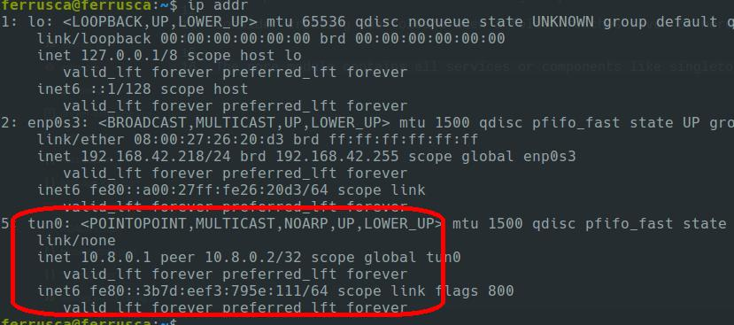

Como podemos ver, por defecto nuestro servidor tiene la dirección ip `10.8.0.1`

En el cliente
==============


Para el cliente, basta con instalar `openvpn` y tener el archivo de configuración expedido por el servidor

```sh
$cliente@cliente:~$ sudo apt install openvpn

```

Para iniciar el servicio: 
```sh
$cliente@cliente:~$ sudo openvpn --config client1.ovpn
```

Si está correcto, veremos los siguientes mensajes en la terminal:

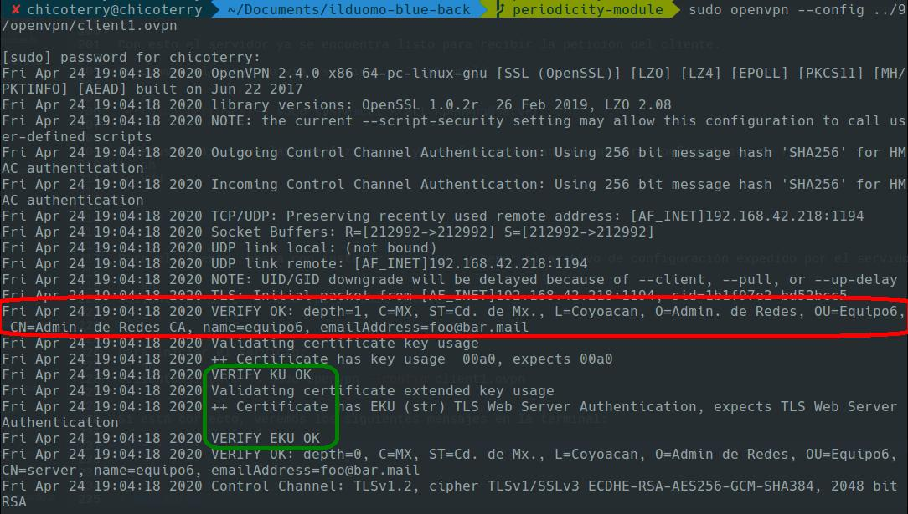

Podemos ver que además de nuestra interfaz por defecto (en este caso la `enp0s18u1u1`), se creo una nueva interfaz de _tunnel_ `tun0` a la cual se le asignó la dirección ip `10.8.0.6`

Interfaz por defecto:

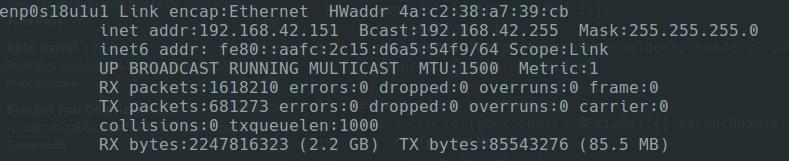

Interfaz VPN:

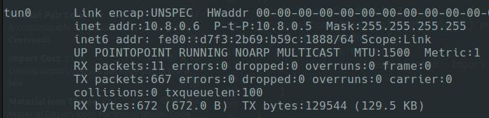

Ahora para comprobar, hacemos un ping al servidor `10.8.0.1`

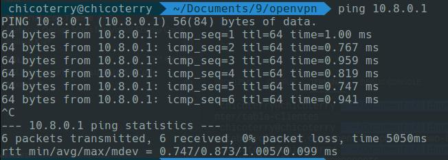

# Monitoreo

Para el monitoreo a través de SNMP, elegimos la herramienta de **Nagios**

##Instalación:

Descargamos de la pagina oficial, la máquina virtual de nagios XI, la cual viene con el software precargado sobre un _RedHat_

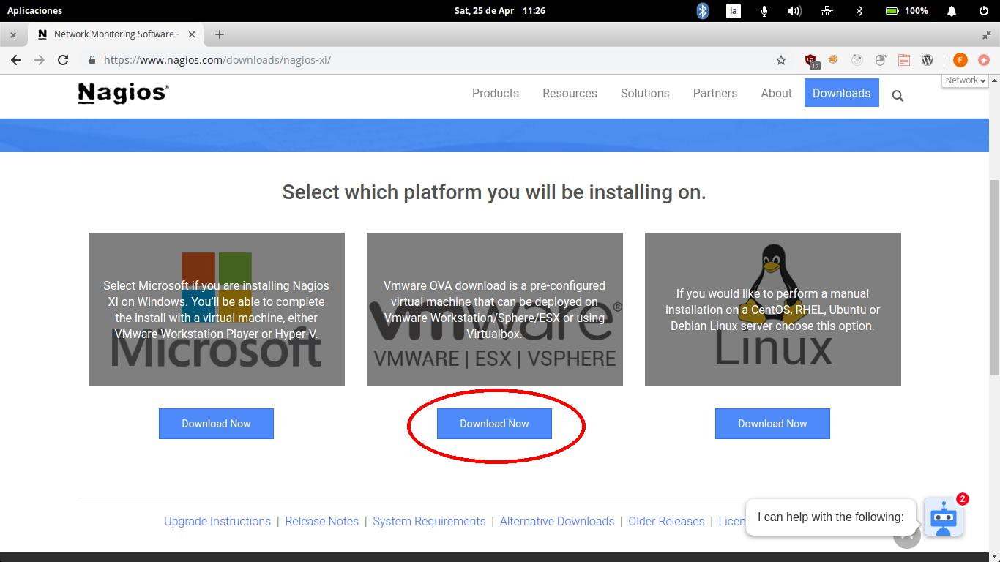


Posteriormente, y una vez que ejecutemos la VM, accedemos a la interfaz de instalación del software:

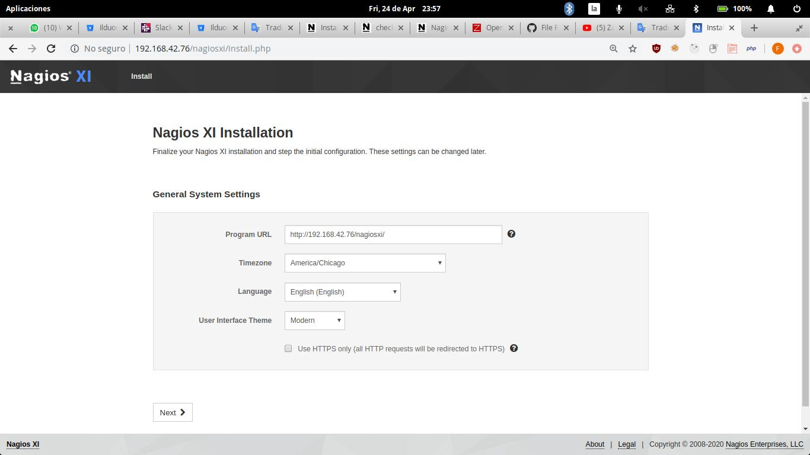
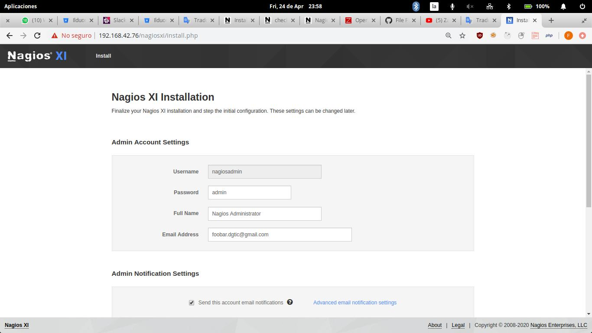


Monitoreo
=========

Una vez con _Nagios_ instalado, iniciamos sesión a traves de la interfaz web en http://x.x.x.x/nagiosxi/login.php.

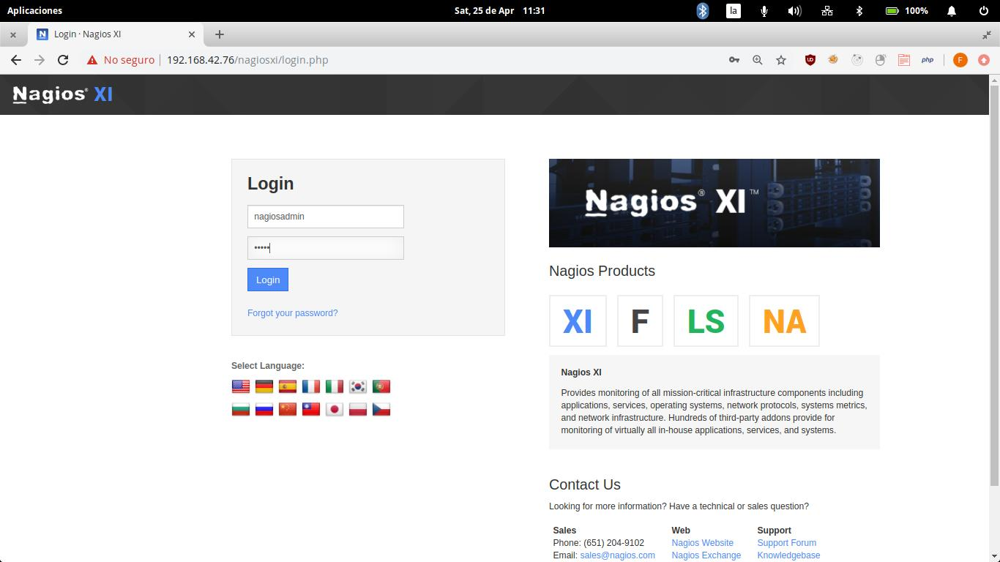


Lo siguiente será dar de alta el equipo a monitorear (Servidor VPN).


Añadiendo el Host remoto
==========================+

Para poder monitorear el host remoto, es necesario instalar el agente **NRPE** (_Nagios Remote Plugin Executor_) que nos va a permitir monitorear el equipo desde el exterior.

Para ello instalamos

```sh
ferrusca@ferrusca:~$ sudo apt install nagios-nrpe-server nagios-plugins
```

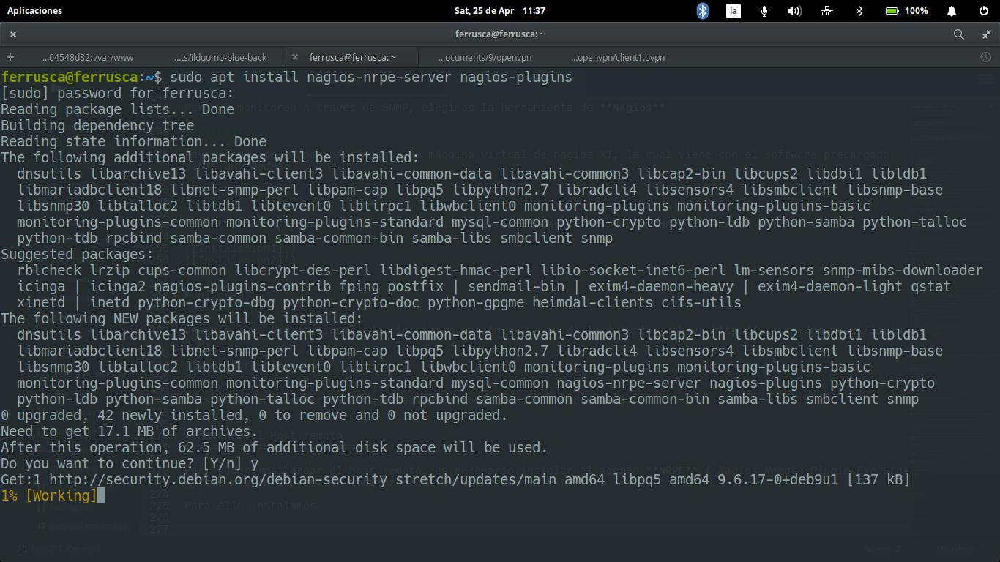


Después, editamos el archivo de configuración de NPRE para indicar al dirección IP del servidor Nagios, así como para darle acceso al mismo

```sh
ferrusca@ferrusca:~$ sudo vim /etc/nagios/nrpe.cfg
```

Se editan las directivas `server_address` y  `allowed_hosts`

```sh
server_address=192.168.42.76
allowed_hosts=127.0.0.1, 192.168.42.76
``` 

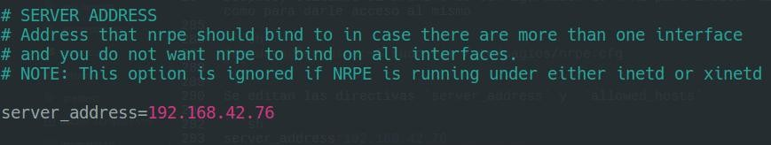

Guardamos el archivo y reiniciamos el servicio de NPRE
```sh
ferrusca@ferrusca:~$ systemctl restart nagios-nrpe-server
```


